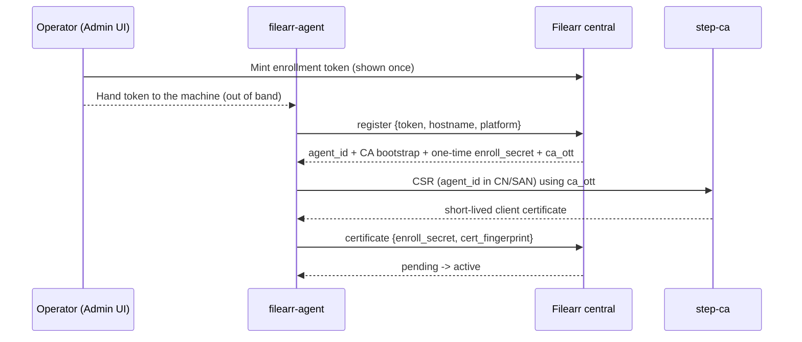

# Distributed agents

Filearr can coordinate a fleet of **distributed agents**: a small companion
program on each remote machine that scans *that host's* local disks, keeps a
**local, offline-usable** index, and replicates lightweight file-change events up
to the central server over mTLS.

!!! info "Agents are opt-in and off by default"
    A single-node Filearr deployment is entirely unaffected by any of this. With
    `FILEARR_AGENTS_ENABLED=false` (the default), the agent API returns 404, the
    Admin → Agents panel is hidden, and the certificate authority never runs. The
    tables still exist (empty), so enabling later needs no migration.

## What the agent is (and is not)

- **It is** an offline-first local catalog plus a reliable, at-least-once,
  idempotent replication client. Local search answers "where did I put that
  file" using path / size / mtime / hashes / filename-derived title.
- **It is not** a full metadata extractor. Heavy or exotic per-type extraction
  (3D mesh, structured document properties) stays **central** and runs after
  replication. Central remains the single source of truth; the agent's local
  index is disposable and rebuildable from a filesystem walk, exactly as
  Meilisearch is one level up.

The agent is a single static Go binary (no cgo), cross-compiled for Windows,
macOS and Linux, using a pure-Go SQLite/FTS5 store.

## Enrollment walkthrough

Enrollment follows a **register-first** trust model: registration precedes
certification, and **no certificate is ever issued before registration**.



Step by step:

1. **Mint a token.** Admin → Agents → **Mint token** (or `POST
   /api/v1/agents/enrollment-tokens`, admin scope). The raw token is shown
   **once** and never stored — only its hash is persisted. Tokens are
   **single-use** and short-lived (`FILEARR_ENROLLMENT_TOKEN_TTL_MINUTES`,
   default 60 — minutes-to-hours, never days). Hand it to the machine out of band.
2. **Register.** On the device:

    ```bash
    filearr-agent enroll -central https://filearr.example.com -token <paste> -name <name>
    ```

    (Hostname defaults to the machine's own.) Central validates and **consumes**
    the token, assigns the authoritative `agent_id`, and returns CA bootstrap
    info, a one-time `enroll_secret`, and a short-lived, single-use `ca_ott`
    (the step-ca token for the next step). The agent is now **pending**.
3. **Get a certificate.** The agent generates a keypair and CSR embedding its
   `agent_id`, and uses the `ca_ott` to obtain a short-lived client cert directly
   from step-ca. Keys never leave the agent; central never proxies the CSR.
4. **Bind the cert.** The agent posts its cert fingerprint with the
   `enroll_secret`; central moves it from **pending** to **active**.

Then start scanning and (optionally) the daemon:

```bash
filearr-agent scan --root <media path>   # repeatable
filearr-agent run                        # replication + policy + self-update daemon
```

Run `filearr-agent run` under a service manager with restart-on-failure (systemd
`Restart=on-failure`, a Windows Service failure action, or launchd `KeepAlive`).

## Replication: the outbox / seq contract

The agent writes each local change and an outbox row in the **same** local
transaction. A drain goroutine reads unsent rows in `seq_no` order, batches them
(by size or age), and POSTs them to central's replication endpoint, marking them
sent only when central ACKs the exact sequence range. If central reports a gap
(it expected a different `seq_no`), the agent rewinds and re-sends — so
replication is **at-least-once and idempotent**, and never drops or half-applies
a change. When offline, the outbox blocks (never drops).

What a replication event carries (the "R1" field set):

- `rel_path`, `size`, `mtime`, `quick_hash`, `content_hash` (content hash may be
  null for large/networked files), and an optional best-effort `share_hint`.
- A `moved` event is a delete+create pair carrying the old path.

The filename-derived title stays **agent-local**; full metadata extraction
happens centrally after the item is replicated. See
[Data collected & how](data-collection.md#what-agents-replicate) for exactly what
leaves the agent machine — and what never does.

## Reconciliation

Beyond the incremental outbox, the agent periodically (and after long offline
periods) pages its **whole manifest** to central for a full-manifest diff. Central
does a server-side anti-join to catch anything the incremental stream missed
(e.g. a deletion during a long outage). This is the safety net behind
replication, analogous to the central Postgres↔Meilisearch reconcile sweep.

## Policy keys

Central pushes a per-scope **policy** the agent polls (with ETag) and applies
within one poll interval. The policy controls which libraries/paths the agent
scans, preset exclude bundles, and the local-access flags below. mTLS is the only
integrity layer on this channel; there is no separate payload signing (a single
operator is the sole policy author). Policy is **advisory-by-asymmetry**: central
can *disable* a local capability and the agent honors it on next poll, but
central cannot reach into the agent to read local-only data.

## Local query CLI, local web UI, and the frecency privacy note

The agent exposes a **local, offline** query surface so search works even when
the machine is disconnected from central:

- **CLI** — `filearr query 'kind:video size:>1G modified:<7d'`. A `filearr`
  alias/symlink to the binary gives the branded verb.
- **Local web UI** — a minimal, **read-only** search page the `run` daemon can
  serve. It is **loopback-only** (default `127.0.0.1:8686`; a non-loopback bind
  is refused), **GET/HEAD-only**, Host-header allow-listed (DNS-rebinding
  defense), CSRF-protected, and gated by a one-time bootstrap token printed to the
  log (Jupyter-style), exchanged for an `HttpOnly`, `SameSite=Strict` session
  cookie. It is **policy-gated and fails closed**: it serves only while central
  policy enables it *and* the cached policy is fresh; a never-contacted agent
  starts with it off.

!!! note "Local search history never leaves the machine"
    The agent can rank your recent queries (zoxide-style frequency + recency) to
    offer suggestions. This history lives in a **separate** local database file
    from the index/outbox. The replication subsystem is only ever handed the
    index store's handle, so it is *incapable* of touching a history row — the
    isolation is architectural, not merely policy-gated. Central holds no copy;
    wiping the agent's data directory erases the history with no way to restore it.

## Self-update with signed releases

Agents self-update from an **operator-signed manifest**. Central stores and serves
the manifest and artifacts but is **untrusted for update integrity** — it cannot
re-sign a manifest, so a compromised central cannot push a wrongly-signed binary.

- The **signing private key lives only on your signing machine** (default
  `~/.filearr-signing`), backed up to a vault, never committed, never on central.
- The matching **public key is pinned into the agent binary at build time**
  (`-ldflags`). A binary built **without** the pin refuses every update
  (fail-closed) — fine for dev, wrong for a fleet.
- Each release is Ed25519-signed over a canonical manifest; the agent re-derives
  the canonical bytes and verifies before swapping.

**Rollout is staged:** a signed manifest lands as `canary` and is offered only to
agents in the canary rollout group; once the canary wave confirms healthy, an
operator **promotes** it to the whole fleet.

**Rollback is automatic:** a newly swapped binary is on trial — it writes a boot
counter and runs a 60-second health window on each launch. On pass it clears the
counter and confirms its version. If it crashes through 3 launch attempts without
passing, the next launch **restores the previous binary** and re-execs it. A
sha256 mismatch, an invalid signature, or an unpinned build all refuse the update
rather than swapping.

See [Security → Signed agent updates](security.md#signed-agent-updates) for the
key-handling contract.

## Transfers / retrieve flow

Central can ask an agent to do one thing on demand through an **agent commands**
queue: a cheap `stat_check` (existence/freshness), a stronger `rehash_check`
(re-read the quick/content hash to verify), or a `stage_upload` that starts an
agent→central **retrieve**. A retrieve stages the file to central's writable disk
(never a media mount) as a resumable, chunked upload, from which it can be
downloaded within a TTL. Offline is the normal case, so a retrieve waits patiently
and the staged file survives to be (re-)downloaded within its window.

## Share-location hints and admin mappings

An agent reports a best-effort network-share hint for the items it owns (a
`share_url` / UNC / host, marked as agent-sourced). This is advisory — anonymous
shares, permission-scoped enumeration, and multi-homed hosts mean many agents
report nothing — and falls through to a central share mapping when absent, so the
"open on the network" hint works even when an agent can't discover its own share.

## Agent thumbnails

Agents can generate thumbnails locally and upload them (JPEG, size-capped) so the
central grid has a preview for agent-hosted items without retrieving the whole
file. ffmpeg is optional on the agent for video poster frames; without it, image
thumbnails still work.

## Killing an agent: revoke vs delete

- **Revoke** (Admin → Agents → revoke, or `DELETE /api/v1/agents/{id}`) is an
  application-layer denylist: the agent is refused on every replication/config
  request regardless of whether its short-lived cert is still cryptographically
  valid. The row and its replication history are kept. Combined with the short
  (24–72h) cert TTL and refuse-to-renew, this bounds a stolen-cert blast radius
  without running CRL/OCSP.
- **Hard delete** (`DELETE /api/v1/agents/{id}?purge=true`) removes the row
  entirely — the cleanup path for failed-enrollment pending rows and
  decommissioned machines with no data footprint. It is refused (409) while any
  library or item still references the agent.

For CA setup, the null-`ca_ott` failure class, and re-enrollment recovery, see
[Operations → agent enrollment / CA](operations.md#agent-enrollment-ca-step-ca-failures).
