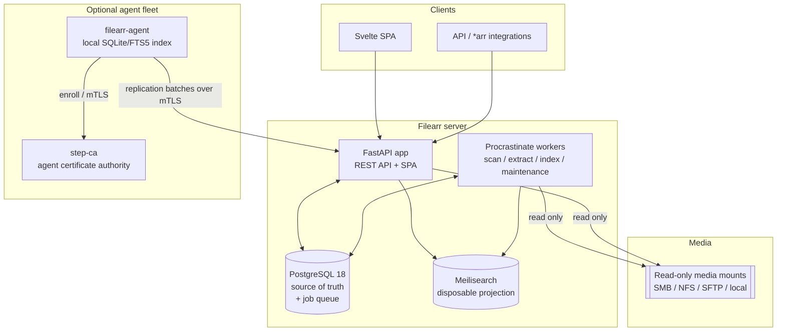

# Filearr

**Filearr** is a self-hosted, unified catalog and search engine for your files and
media. It scans your filesystems directly — video, music, audiobooks, audio
samples, images, 3D models, documents and spreadsheets — and gives you
**typo-tolerant, instant search** across everything, with a public REST API for
both search **and** metadata edits.

It is Docker-first and homelab-friendly (Unraid and Proxmox deploy paths ship in
the box), and it can optionally coordinate a fleet of **distributed agents** that
index other machines and replicate their catalogs to a central server.

!!! quote "Design in one sentence"
    Postgres is the single source of truth; Meilisearch is a **disposable**
    search projection that can always be rebuilt from Postgres; and nothing ever
    phones home.

## Feature tour

- **One search box for every kind of file.** A single index spans video, audio,
  audiobooks, samples, images, 3D models, documents and spreadsheets, with
  per-library include/exclude rules.
- **Typo tolerance and facets.** Powered by Meilisearch: instant results, typo
  correction, faceted filtering, and (optionally) local semantic/hybrid search.
- **Rich, per-type metadata extraction.** ffprobe for video, audio tags, EXIF
  for images (GPS hidden by default), document properties and body text,
  archive member listings, on-demand cryptographic digests, and thumbnails /
  video poster frames.
- **Your edits are safe from rescans.** Extracted metadata and your manual edits
  live in separate columns; a rescan can never clobber what you typed.
- **Nothing is ever hard-deleted by a scan.** Missing files are tombstoned into a
  recycle bin and purged only after a configurable retention window.
- **A real API.** The public REST surface supports search, item updates, batch
  edits, saved searches, custom reports, exports, and an interactive
  OpenAPI/Swagger UI at `/api/docs`.
- **Filter builder + query DSL.** Build structured queries visually, preview them
  live, and save them as custom reports.
- **Identity & access when you need it.** API keys with read/write/admin scopes,
  Postgres-backed login sessions, optional OIDC SSO and LDAP/AD, and path-scoped
  RBAC.
- **Optional distributed agents.** A single static Go binary per machine keeps a
  local offline index and replicates lightweight change events to central over
  mTLS.

## Architecture at a glance

The **app** serves the API and the single-page UI. **Workers** run the scan,
extraction, indexing and maintenance jobs through a Postgres-native job queue
(Procrastinate — no Redis). **Postgres** holds everything that cannot be
recreated by re-scanning; **Meilisearch** is a rebuildable search projection.
Media mounts are always **read-only**. The **agent fleet** is entirely optional
and off by default.

## Architecture invariants

These rules are load-bearing. Everything else in the docs follows from them.

1. **The search index is disposable.** Meilisearch is never a store of record —
   everything in it is rebuildable from Postgres via a rebuild-index job.
2. **Extracted metadata and user edits are separate columns.** Scans and
   extractors only write the extracted `metadata`; API/UI edits only write
   `user_metadata`. The effective value is the user overlay on top of the
   extracted value.
3. **Item identity is `(library, relative path)`**, not the absolute path. The
   absolute path is refreshed on every scan; the relative path is stable across
   mount relocations.
4. **Scans never hard-delete.** A missing file is tombstoned (`missing` /
   `trashed`) and purged only by a scheduled recycle-bin sweep after the
   retention window.
5. **Media mounts are read-only.** File write-back is a future (v2) capability.
6. **No external telemetry.** Filearr never phones home. See
   [Data collected & how](data-collection.md).

## License and source (AGPL section 13)

Filearr is free software licensed under the **GNU Affero General Public License,
version 3 or later (AGPL-3.0-or-later)**.

Because Filearr is typically offered to users over a network, **AGPL section 13**
applies: an operator who runs Filearr (including a modified version) for other
users must offer those users the **Corresponding Source** of the running version.
Filearr builds this obligation in — the running instance exposes a **"Source"**
link (served from `GET /api/v1/version` as `source_url` and rendered in the UI
footer), which an operator running a fork can point at *their* modified source
without rebuilding the frontend. Configure it with `FILEARR_SOURCE_URL`.

Contributions are accepted under the same license with a DCO sign-off.

## Where to next

- [Setup requirements](setup.md) — hardware, platforms, dependency versions,
  ports.
- [Deployment](deployment/index.md) — Docker Compose, Unraid, and Proxmox LXC.
- [Distributed agents](agents.md) — enroll and operate the agent fleet.
- [Security](security.md) — auth, RBAC, agent-plane trust, audit.
- [Data collected & how](data-collection.md) — exactly what a scan reads.
- [Operations & recovery](operations.md) — the runbook.
